# FlowerShop

[](https://github.com/lavantien/FlowerShop/actions/workflows/ci.yml)
[](https://github.com/lavantien/FlowerShop/actions/workflows/ci.yml)
[](https://github.com/lavantien/FlowerShop/actions/workflows/ci.yml)


eCommerce web app: a Spring Boot 4 REST API with JPA, BCrypt password hashing, and token auth, an Angular 22 storefront with an admin console, and MySQL 9.7 LTS storage. The Maven wrapper and `make` targets wrap every build, test, and run step, and the build provisions its own Node 24, so the host needs only a JDK, Docker, and make.

## Requirements

1. `JDK 27`
2. `Docker`, which runs MySQL 9.7 LTS through `make db-up`
3. `MySQL Server 9.7 LTS`, or the Docker container above
4. An editor of your choice: Neovim (my config lives at [github.com/lavantien/dotfiles](https://github.com/lavantien/dotfiles)), VS Code, or IntelliJ IDEA Community
5. `Postman` or `Insomnia` for ad hoc API calls

## Pictures

1. Guest shop page
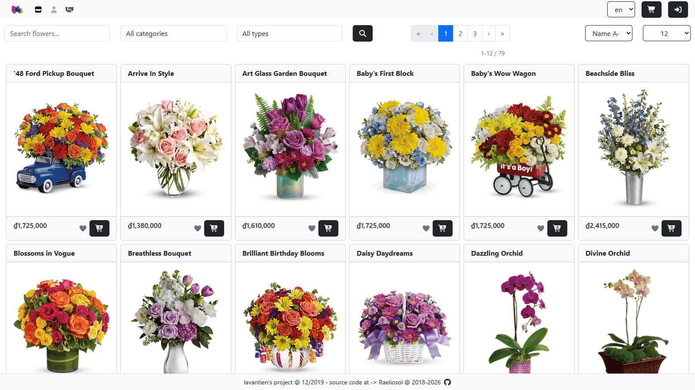
2. Guest shopping cart
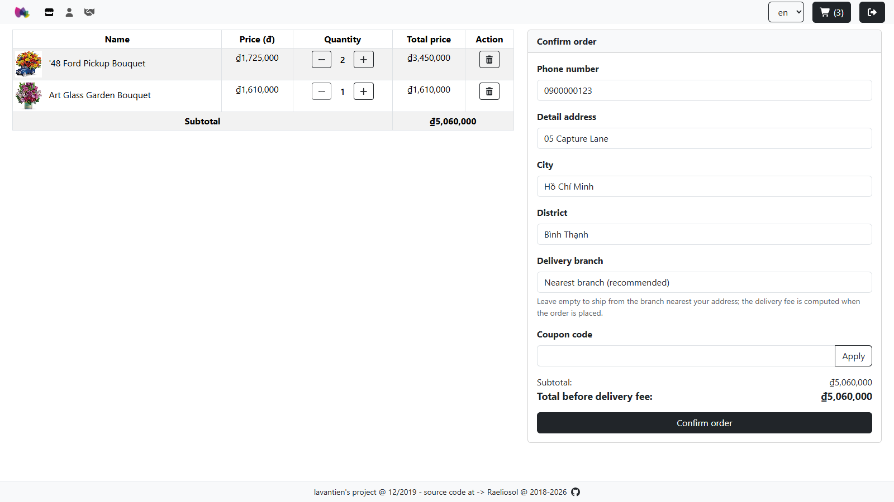
3. Member account details
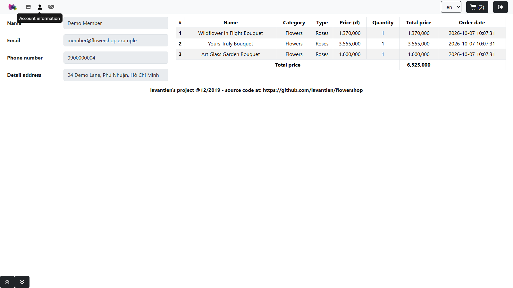
4. Admin products listing
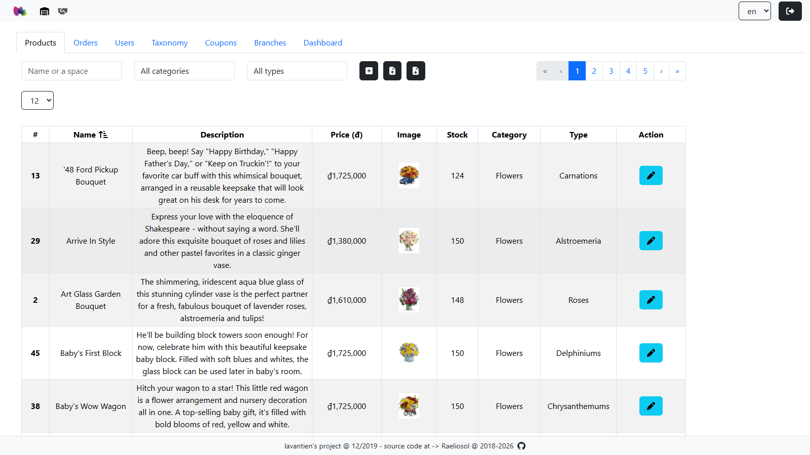
5. Admin transaction summary
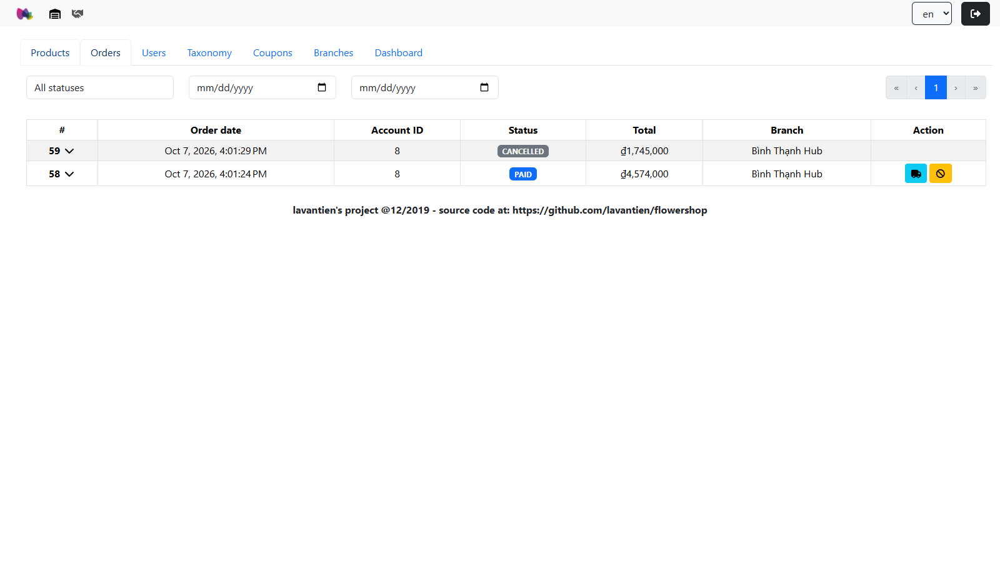
6. Admin create new product
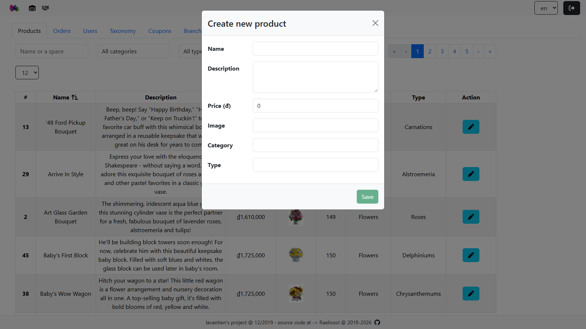
7. Admin import products from Excel
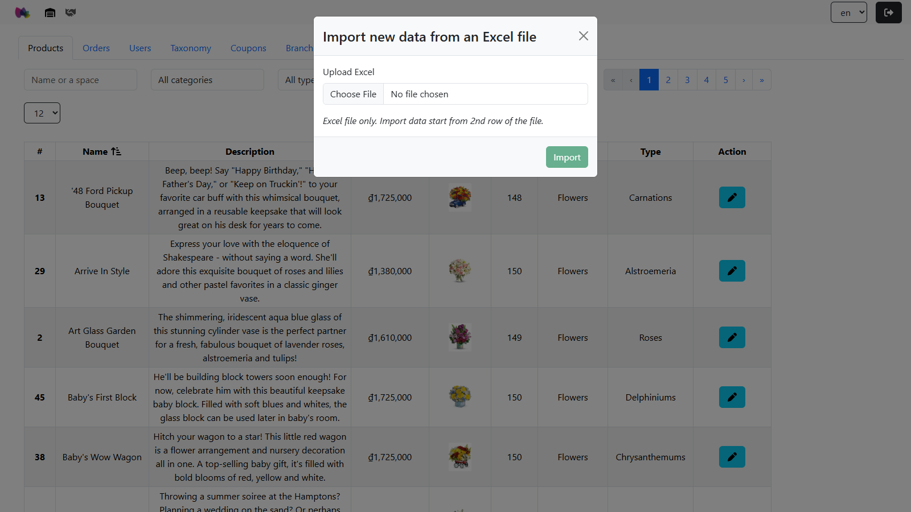
8. Admin export products to Excel
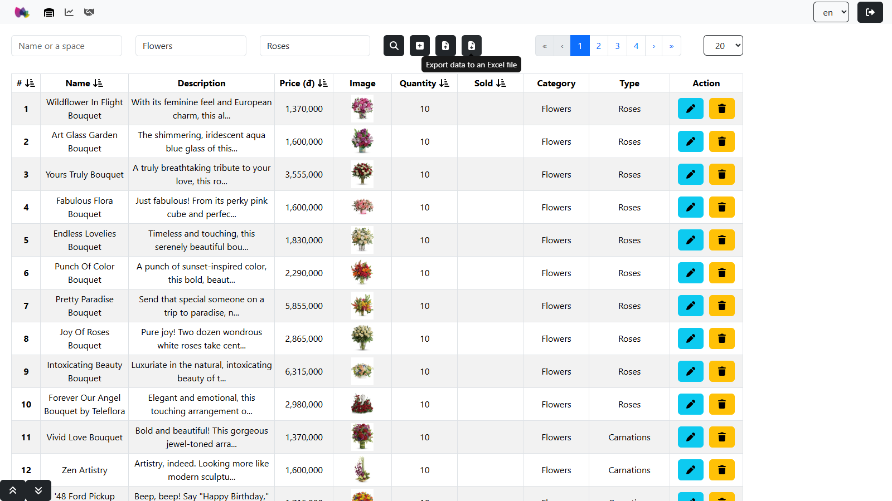
9. Admin edit product
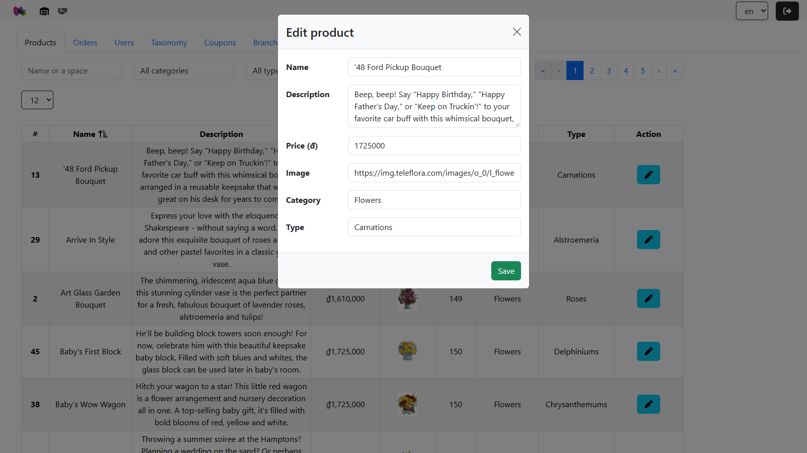
10. Admin batch delete
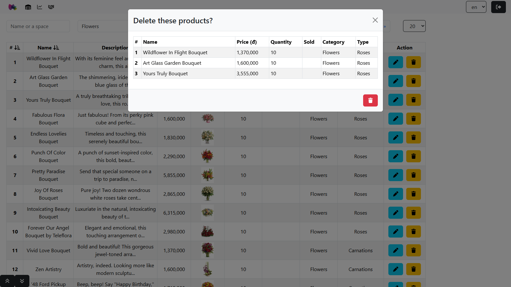
11. Product details on click
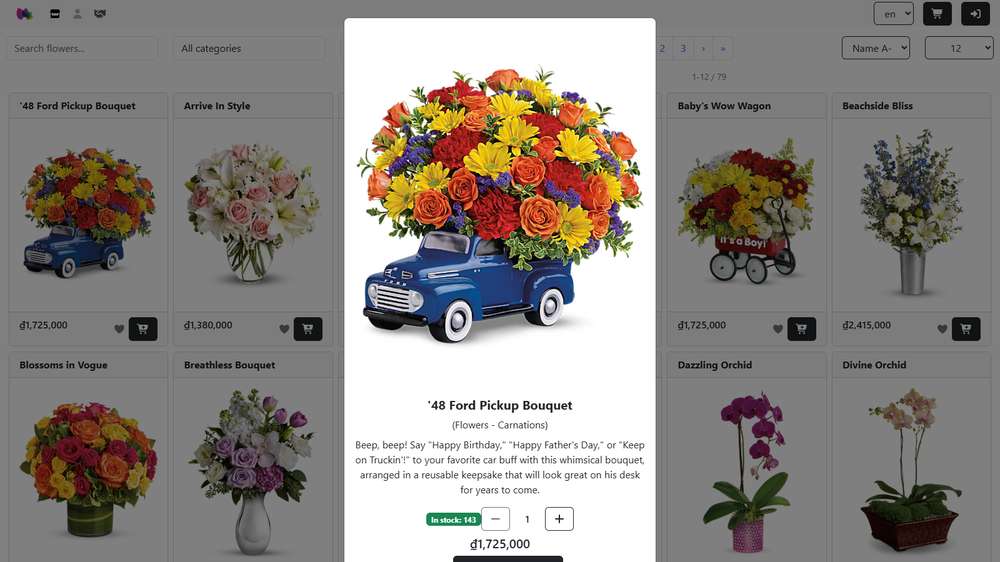

Regenerate this set against the current build with `make screenshots`.

## Development environment setup

1. Open the root folder in your editor: Neovim with [github.com/lavantien/dotfiles](https://github.com/lavantien/dotfiles), VS Code, or IntelliJ IDEA Community. No build step depends on the choice.
2. Edit `application.yml` for your MySQL account, or set the `LOCAL_MYSQL_DB_*` environment variables.
3. Start the database with `make db-up`, then run the first 2 lines of `db/run.sql` to create the `flowershop` schema.
4. Launch `FlowershopApplication`, or run `make run` to start the jar and `make backend-test` for the test suite. The first boot creates the tables.
5. Run the rest of `db/run.sql` to seed the demo data.
6. In `Postman`, log in as the demo admin (`admin@flowershop.example` / `1234qwer`, `POST` at `http://localhost:8080/api/user/login`), then call `POST` at `http://localhost:8080/api/product` with the `JSON body` copied from `db/product.json` and the returned token in the `X-Auth-Token` header.
7. Run `make frontend-install`, then `make frontend-serve` for the dev server at `http://localhost:4200`, proxying `/api` requests to `:8080`.
8. Open `http://localhost:4200` in a browser.

## Production environment setup

1. The host needs `JDK 27` and `MySQL Server 9.7 LTS`. Set up the database and `application.yml` as in development.
2. Run `make package` (or `./mvnw clean package`) from the root folder. This creates `target/flowershop-2.0.jar`.
3. Run the jar with `java -jar target/flowershop-2.0.jar`.
4. On AWS: an EC2 instance or a Lightsail VPS runs the jar, RDS serves MySQL 9.7, and S3 holds backups and static assets.

## Build logs

### Historical build (Aug 7 2020, Spring Boot 2.3 / Angular 10)
```
[INFO] Results:
[INFO] 
[INFO] Tests run: 1, Failures: 0, Errors: 0, Skipped: 0
[INFO] 
[INFO] 
[INFO] --- maven-jar-plugin:3.2.0:jar (default-jar) @ flowershop ---
[INFO] Building jar: /home/lavantien/Documents/dev/flowershop/target/flowershop-1.1.jar
[INFO] 
[INFO] --- spring-boot-maven-plugin:2.3.2.RELEASE:repackage (repackage) @ flowershop ---
[INFO] Replacing main artifact with repackaged archive
[INFO] ------------------------------------------------------------------------
[INFO] BUILD SUCCESS
[INFO] ------------------------------------------------------------------------
[INFO] Total time:  44.918 s
[INFO] Finished at: 2020-08-07T00:57:12+07:00
[INFO] ------------------------------------------------------------------------
```

### Build log (Oct 6 2026)
```
[INFO] Results:
[INFO] 
[INFO] Tests run: 1, Failures: 0, Errors: 0, Skipped: 0
[INFO] 
[INFO] 
[INFO] --- jar:3.5.1:jar (default-jar) @ flowershop ---
[INFO] Building jar: C:\Users\lavantien\dev\github\FlowerShop\target\flowershop-2.0.jar
[INFO] 
[INFO] --- spring-boot:4.1.1:repackage (repackage) @ flowershop ---
[INFO] Replacing main artifact C:\Users\lavantien\dev\github\FlowerShop\target\flowershop-2.0.jar with repackaged archive, adding nested dependencies in BOOT-INF/.
[INFO] The original artifact has been renamed to C:\Users\lavantien\dev\github\FlowerShop\target\flowershop-2.0.jar.original
[INFO] ------------------------------------------------------------------------
[INFO] BUILD SUCCESS
[INFO] ------------------------------------------------------------------------
[INFO] Total time:  15.161 s
[INFO] Finished at: 2026-10-06T21:30:24+07:00
[INFO] ------------------------------------------------------------------------
```

### Build log (Oct 7 2026)
```
[INFO] Results:
[INFO] 
[INFO] Tests run: 119, Failures: 0, Errors: 0, Skipped: 0
[INFO] 
[INFO] 
[INFO] --- jar:3.5.1:jar (default-jar) @ flowershop ---
[INFO] Building jar: C:\Users\lavantien\dev\github\FlowerShop\target\flowershop-2.0.jar
[INFO] 
[INFO] --- spring-boot:4.1.1:repackage (repackage) @ flowershop ---
[INFO] Replacing main artifact C:\Users\lavantien\dev\github\FlowerShop\target\flowershop-2.0.jar with repackaged archive, adding nested dependencies in BOOT-INF/.
[INFO] The original artifact has been renamed to C:\Users\lavantien\dev\github\FlowerShop\target\flowershop-2.0.jar.original
[INFO] ------------------------------------------------------------------------
[INFO] BUILD SUCCESS
[INFO] ------------------------------------------------------------------------
[INFO] Total time:  35.854 s
[INFO] Finished at: 2026-10-07T10:51:45+07:00
[INFO] ------------------------------------------------------------------------
```
